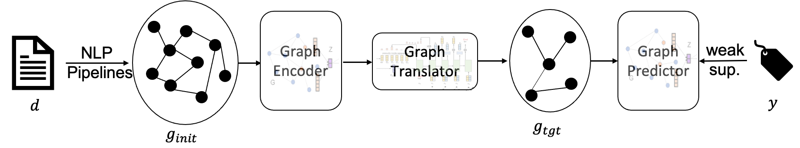
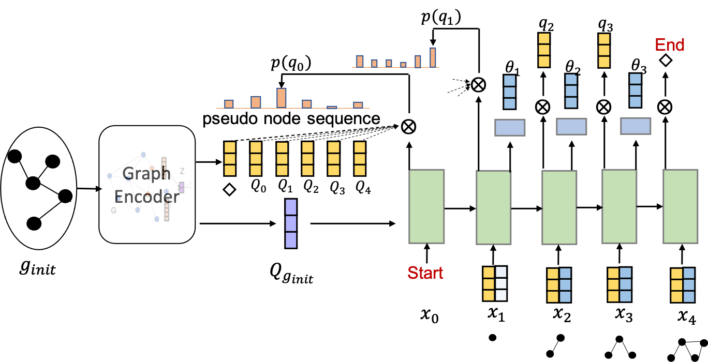
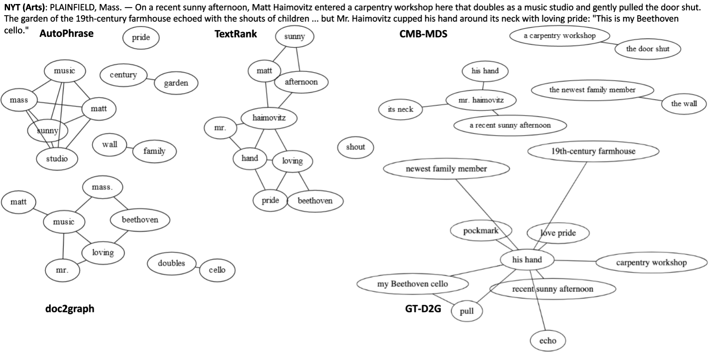
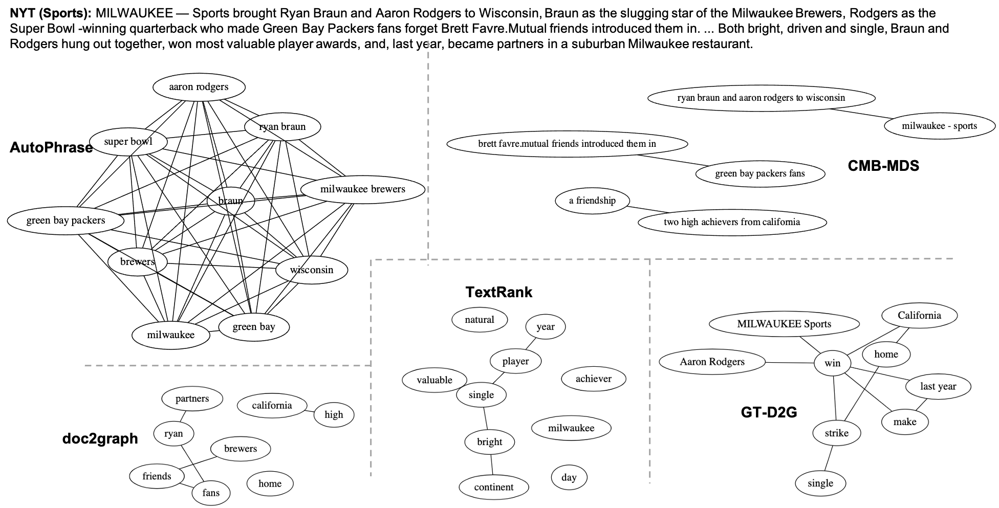
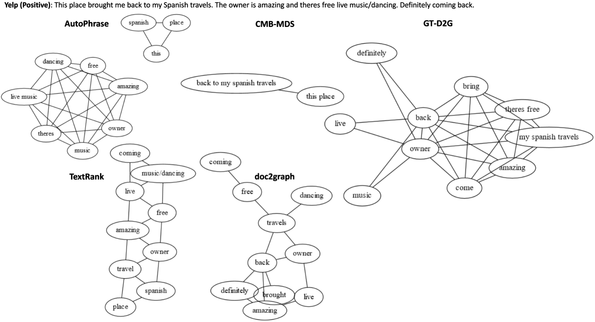
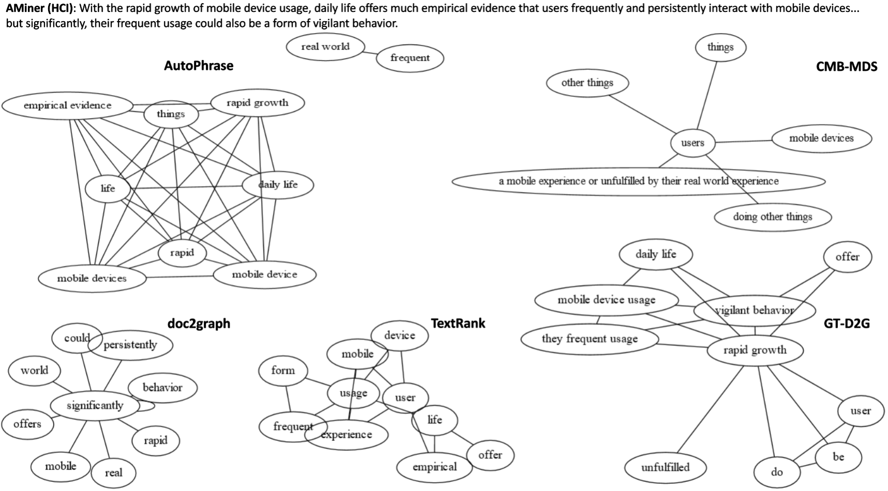

# Weakly Supervised Concept Map Generation through Task-Guided Graph Translation

[![DOI](https://img.shields.io/badge/doi-10.6084/m9.figshare.16415802-blue.svg?style=flat&labelColor=whitesmoke&logo=data%3Aimage%2Fpng%3Bbase64%2CiVBORw0KGgoAAAANSUhEUgAAAB8AAAAfCAYAAAAfrhY5AAAJsklEQVR42qWXd1DTaRrHf%2BiB2Hdt5zhrAUKz4IKEYu9IGiGFFJJQ0gkJCAKiWFDWBRdFhCQUF3UVdeVcRQEBxUI3yY9iEnQHb3bdW1fPubnyz%2F11M7lvEHfOQee2ZOYzPyDv%2B3yf9%2Fk95YX4fx%2BltfUt08GcFEuPR4U9hDDZ%2FVngIlhb%2FSiI6InkTgLzgDcgfvtnovhH4BzoVlrbwr55QnhCtBW4QHXnFrZbPBaQoBh4%2FSYH2EnpBEtqcDMVzB93wA%2F8AFwa23XFGcc8CkT3mxz%2BfXWtq9T9IQlLIXYEuHojudb%2BCM7Hgdq8ydi%2FAHiBXyY%2BLjwFlAEnS6Jnar%2FvnQVhvdzasad0eKvWZKe8hvDB2ofLZ%2FZEcWsh%2BhyIuyO5Bxs2iZIE4nRv7NWAb0EO8AC%2FWPxjYAWuOEX2MSXZVgPxzmRL3xKz3ScGpx6p6QnOx4mDIFqO0w6Q4fEhO5IzwxlSwyD2FYHzwAW%2BAZ4fEsf74gCumykwNHskLM7taQxLYjjIyy8MUtraGhTWdkfhkFJqtvuVl%2F9l2ZquDfEyrH8B0W06nnpH3JtIyRGpH1iJ6SfxDIHjRXHJmdQjLpfHeN54gnfFx4W9QRnovx%2FN20aXZeTD2J84hn3%2BqoF2Tqr14VqTPUCIcP%2B5%2Fly4qC%2BUL3sYxSvNj1NwsVYPsWdMUfomsdkYm3Tj0nbV0N1wRKwFe1MgKACDIBdMAhPE%2FwicwNWxll8Ag40w%2BFfhibJkGHmutjYeQ8gVlaN%2BjO51nDysa9TwNUFMqaGbKdRJZFfOJSp6mkRKsv0rRIpEVWjAvyFkxNOEpwvcAVPfEe%2Bl8ojeNTx3nXLBcWRrYGxSRjDEk0VlpxYrbe1ZmaQ5xuT0u3r%2B2qe5j0J5uytiZPGsRL2Jm32AldpxPUNJ3jmmsN4x62z1cXrbedXBQf2yvIFCeZrtyicZZG2U2nrrBJzYorI2EXLrvTfCSB43s41PKEvbZDEfQby6L4JTj%2FfIwam%2B4%2BwucBu%2BDgNK05Nle1rSt9HvR%2FKPC4U6LTfvUIaip1mjIa8fPzykii23h2eanT57zQ7fsyYH5QjywwlooAUcAdOh5QumgTHx6aAO7%2FL52eaQNEShrxfhL6albEDmfhGflrsT4tps8gTHNOJbeDeBlt0WJWDHSgxs6cW6lQqyg1FpD5ZVDfhn1HYFF1y4Eiaqa18pQf3zzYMBhcanlBjYfgWNayAf%2FASOgklu8bmgD7hADrk4cRlOL7NSOewEcbqSmaivT33QuFdHXj5sdvjlN5yMDrAECmdgDWG2L8P%2BAKLs9ZLZ7dJda%2BB4Xl84t7QvnKfvpXJv9obz2KgK8dXyqISyV0sXGZ0U47hOA%2FAiigbEMECJxC9aoKp86re5O5prxOlHkcksutSQJzxZRlPZmrOKhsQBF5zEZKybUC0vVjG8PqOnhOq46qyDTDnj5gZBriWCk4DvXrudQnXQmnXblebhAC2cCB6zIbM4PYgGl0elPSgIf3iFEA21aLdHYLHUQuVkpgi02SxFdrG862Y8ymYGMvXDzUmiX8DS5vKZyZlGmsSgQqfLub5RyLNS4zfDiZc9Edzh%2FtCE%2BX8j9k%2FqWB071rcZyMImne1SLkL4GRw4UPHMV3jjwEYpPG5uW5fAEot0aTSJnsGAwHJi2nvF1Y5OIqWziVCQd5NT7t6Q8guOSpgS%2Fa1dSRn8JGGaCD3BPXDyQRG4Bqhu8XrgAp0yy8DMSvvyVXDgJcJTcr1wQ2BvFKf65jqhvmxXUuDpGBlRvV36XvGjQzLi8KAKT2lYOnmxQPGorURSV0NhyTIuIyqOmKTMhQ%2BieEsgOgpc4KBbfDM4B3SIgFljvfHF6cef7qpyLBXAiQcXvg5l3Iunp%2FWv4dH6qFziO%2BL9PbrimQ9RY6MQphEfGUpOmma7KkGzuS8sPUFnCtIYcKCaI9EXo4HlQLgGrBjbiK5EqMj2AKWt9QWcIFMtnVvQVDQV9lXJJqdPVtUQpbh6gCI2Ov1nvZts7yYdsnvRgxiWFOtNJcOMVLn1vgptVi6qrNiFOfEjHCDB3J%2BHDLqUB77YgQGwX%2Fb1eYna3hGKdlqJKIyiE4nSbV8VFgxmxR4b5mVkkeUhMgs5YTi4ja2XZ009xJRHdkfwMi%2BfocaancuO7h%2FMlcLOa0V%2FSw6Dq47CumRQAKhgbOP8t%2BMTjuxjJGhXCY6XpmDDFqWlVYbQ1aDJ5Cptdw4oLbf3Ck%2BdWkVP0LpH7s9XLPXI%2FQX8ws%2Bj2In63IcRvOOo%2BTTjiN%2BlssfRsanW%2B3REVKoavBOAPTXABW4AL7e4NygHdpAKBscmlDh9Jysp4wxbnUNna3L3xBvyE1jyrGIkUHaqQMuxhHElV6oj1picvgL1QEuS5PyZTEaivqh5vUCKJqOuIgPFGESns8kyFk7%2FDxyima3cYxi%2FYOQCj%2F%2B9Ms2Ll%2Bhn4FmKnl7JkGXQGDKDAz9rUGL1TIlBpuJr9Be2JjK6qPzyDg495UxXYF7JY1qKimw9jWjF0iV6DRIqE%2B%2FeWG0J2ofmZTk0mLYVd4GLiFCOoKR0Cg727tWq981InYynvCuKW43aXgEjofVbxIqrm0VL76zlH3gQzWP3R3Bv9oXxclrlO7VVtgBRpSP4hMFWJ8BrUSBCJXC07l40X4jWuvtc42ofNCxtlX2JH6bdeojXgTh5TxOBKEyY5wvBE%2BACh8BtOPNPkApjoxi5h%2B%2FFMQQNpWvZaMH7MKFu5Ax8HoCQdmGkJrtnOiLHwD3uS5y8%2F2xTSDrE%2F4PT1yqtt6vGe8ldMBVMEPd6KwqiYECHDlfbvzphcWP%2BJiZuL5swoWQYlS%2Br7Yu5mNUiGD2retxBi9fl6RDGn4Ti9B1oyYy%2BMP5G87D%2FCpRlvdnuy0PY6RC8BzTA40NXqckQ9TaOUDywkYsudxJzPgyDoAWn%2BB6nEFbaVxxC6UXjJiuDkW9TWq7uRBOJocky9iMfUhGpv%2FdQuVVIuGjYqACbXf8aa%2BPeYNIHZsM7l4s5gAQuUAzRUoT51hnH3EWofXf2vkD5HJJ33vwE%2FaEWp36GHr6GpMaH4AAPuqM5eabH%2FhfG9zcCz4nN6cPinuAw6IHwtvyB%2FdO1toZciBaPh25U0ducR2PI3Zl7mokyLWKkSnEDOg1x5fCsJE9EKhH7HwFNhWMGMS7%2BqxyYsbHHRUDUH4I%2FAheQY7wujJNnFUH4KdCju83riuQeHU9WEqNzjsJFuF%2FdTDAZ%2FK7%2F1WaAU%2BAWymT59pVMT4g2AxcwNa0XEBDdBDpAPvgDIH73R25teeuAF5ime2Ul0OUIiG4GpSAEJeYW9wDTf43wfwHgHLKJoPznkwAAAABJRU5ErkJggg%3D%3D)](https://doi.org/10.6084/m9.figshare.16415802.v1)

- [GT-D2G Model](#gt-d2g-model)
- [Prerequisites](#prerequisites)
- [Data](#data)
- [Reproduce Classification Results](#reproduce-classification-results)
- [Training](#training)
- [Case Study](#case-study)

----------------------------------

## GT-D2G Model

This is the codebase for reproducing results of [TKDE paper](https://doi.org/10.1109/tkde.2023.3252588): "Weakly Supervised Concept Map Generation through Task-Guided Graph Translation". ([arXiv link](https://arxiv.org/abs/2110.15720))





## Prerequisites

```
python==3.7.9
```

For library requirements, please refer to `./requirements.txt`. (You may replace [PyTorch](https://pytorch.org/) and [dgl](https://www.dgl.ai/pages/start.html) to CPU version)

## Data

**Pre-processed Graphs**

The NLP pipeline derived initial concept maps are available at [NYT link](https://figshare.com/articles/dataset/GT-D2G_Data/16415802?file=30419205), [AMiner link](https://figshare.com/articles/dataset/GT-D2G_Data/16415802?file=30419211), [YELP link](https://figshare.com/articles/dataset/GT-D2G_Data/16415802?file=30419214).   
Put it under the project root directory and decompress it. Then three `*.pickle.gz` files would reside under `./data/`. (No need to decompress *.pickle.gz files)

The expected `./data` folder after downloading necessary resources:
```
./data
|-- dblp.txt     # dblp refer to AMiner corpus used in paper
|-- dblp.win5.pickle.gz
|-- nyt.txt
|-- nyt.win5.pickle.gz
|-- yelp.txt
|-- yelp.sentiment_centric.win5.pickle.gz
```


**Pre-trained Word Embeddings**

*GT-D2G* relies on several pre-trained word embeddings. By default, the scripts read pre-trained embeddings from `./.vector_cache` folder.  
- GloVe for *NYT*, *AMiner*: Download `glove.840B.300d` from https://nlp.stanford.edu/projects/glove/.
- Customed emb for *Yelp*: For yelp dataset, we get the best performan using a hybrid of GloVe and [restaurant embedding](https://howardhsu.github.io/dataset/), which can be download from [link](https://figshare.com/articles/dataset/GT-D2G_Data/16415802?file=30419202).

The expected `./.vector_cache` folder:
```
./.vector_cache
|--glove.840B.300d.txt
|--glove.840B.restaurant.400d.vec
```

## Reproduce Classification Results

**Checkpoints**

- `GT-D2G-path`:  https://figshare.com/articles/dataset/GT-D2G_Data/16415802?file=30419121
- `GT-D2G-neigh`: https://figshare.com/articles/dataset/GT-D2G_Data/16415802?file=30419181
- `GT-D2G-var`:   https://figshare.com/articles/dataset/GT-D2G_Data/16415802?file=30419157

Please download gziped checkpoint files using the above urls, and decompress them under `./checkpoints` folder.

Example of running GT-D2G for reproducibility: `sh run_test.sh`.

## Training

You can train your own GT-D2G by modifying provided examples `run_train.sh`.

## Case Study



-------------------



-------------------



-------------------


