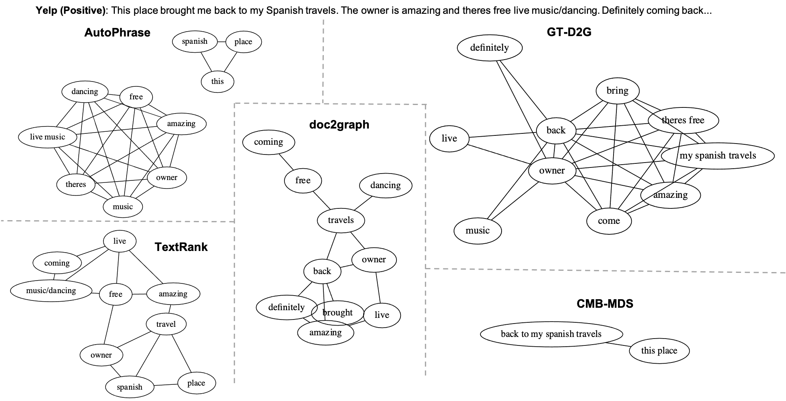
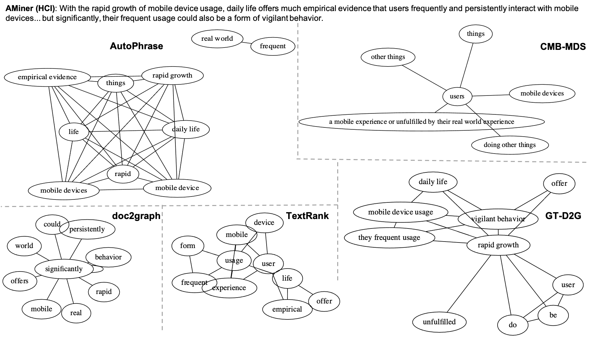

# Weakly Supervised Concept Map Generation through Task-Guided Graph Translation

- [GT-D2G Model](#gt-d2g-model)
- [Prerequisites](#prerequisites)
- [Data](#data)
- [Reproduce Classification Results](#reproduce-classification-results)
- [Training](#training)
- [Case Study](#case-study)

----------------------------------

## GT-D2G Model

This is the codebase for reproducing results of TKDE submission: "Weakly Supervised Concept Map Generation through Task-Guided Graph Translation".


## Prerequisites

```
python==3.7.9
```

For library requirements, please refer to `./requirements.txt`. (You may replace [PyTorch](https://pytorch.org/) and [dgl](https://www.dgl.ai/pages/start.html) to CPU version)

## Data

**Pre-processed Graphs**

The NLP pipeline derived initial concept maps are available at [NYT link](https://figshare.com/s/9dc0d4124af2308bc388?file=30419205), [DBLP link](https://figshare.com/s/9dc0d4124af2308bc388?file=30419211), [YELP link](https://figshare.com/s/9dc0d4124af2308bc388?file=30419214).   
Put it under the project root directory and decompress it. Then three `*.pickle.gz` files would reside under `./data/`. (No need to decompress *.pickle.gz files)

The expected `./data` folder after downloading necessary resources:
```
./data
|-- dblp.txt     # dblp refer to AMiner corpus used in paper
|-- dblp.win5.pickle.gz
|-- nyt.txt
|-- nyt.win5.pickle.gz
|-- yelp.txt
|-- yelp.sentiment_centric.win5.pickle.gz
```


**Pre-trained Word Embeddings**

*GT-D2G* relies on several pre-trained word embeddings. By default, the scripts read pre-trained embeddings from `./.vector_cache` folder.  
- GloVe for *NYT*, *AMiner*: Download `glove.840B.300d` from https://nlp.stanford.edu/projects/glove/.
- Customed emb for *Yelp*: For yelp dataset, we get the best performan using a hybrid of GloVe and [restaurant embedding](https://howardhsu.github.io/dataset/), which can be download from [link](https://figshare.com/s/9dc0d4124af2308bc388?file=30419202).

The expected `./.vector_cache` folder:
```
./.vector_cache
|--glove.840B.300d.txt
|--glove.840B.restaurant.400d.vec
```

## Reproduce Classification Results

**Checkpoints**

- `GT-D2G-path`:  https://figshare.com/s/9dc0d4124af2308bc388?file=30419121
- `GT-D2G-neigh`: https://figshare.com/s/9dc0d4124af2308bc388?file=30419181
- `GT-D2G-var`:   https://figshare.com/s/9dc0d4124af2308bc388?file=30419157

Please download gziped checkpoint files using the above urls, and decompress them under `./checkpoints` folder.

Example of running GT-D2G for reproducibility: `sh run_test.sh`.

## Training

You can train your own GT-D2G by modifying provided examples `run_train.sh`.

## Case Study


-------------------


-------------------



-------------------


